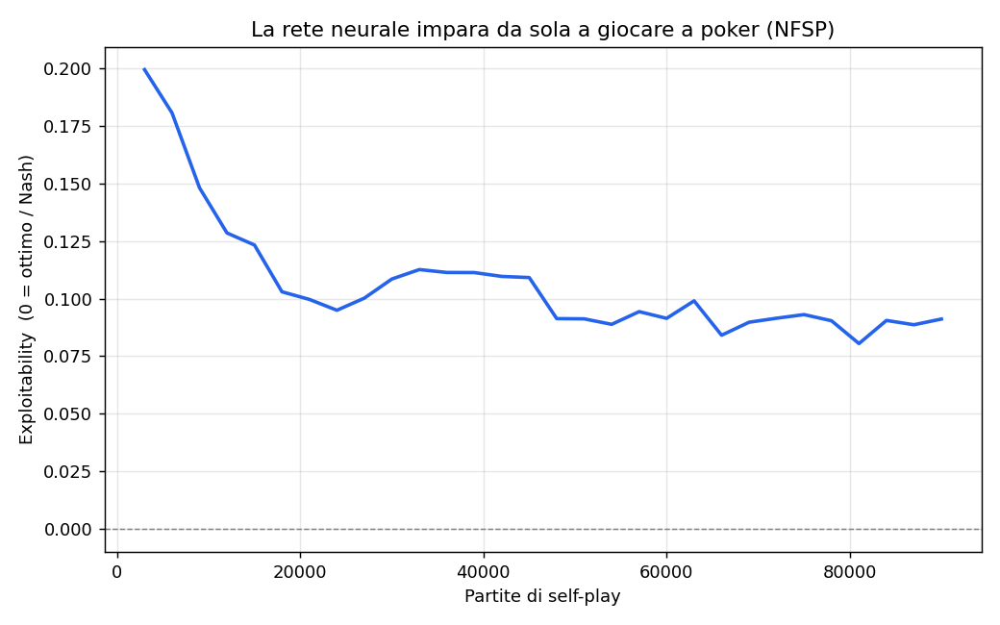
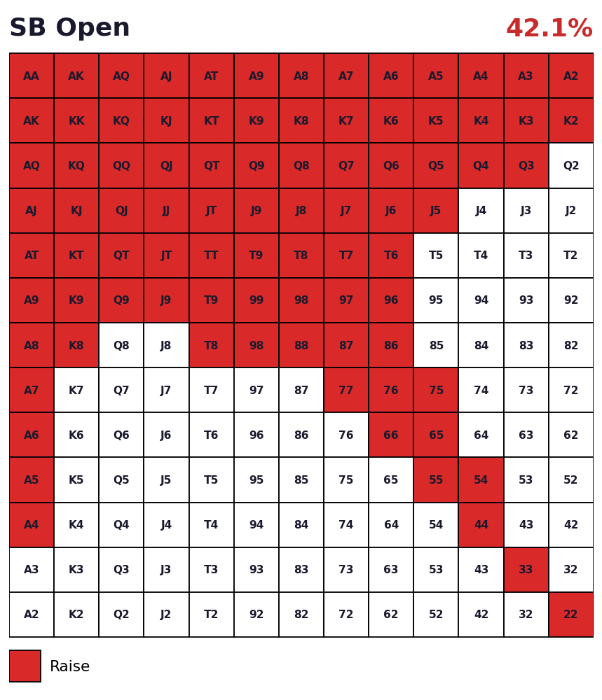

# Poker AI — dal poker minimo al Texas Hold'em

Progetto di ricerca su come un'intelligenza artificiale **impara a giocare a poker da sola**
(reinforcement learning + self-play), con un'interfaccia web per ricevere consigli sulle mani.

[](https://colab.research.google.com/github/UTENTE/poker-ai/blob/main/notebooks/poker_nlhe_colab.ipynb)

> **Demo dal vivo (dopo aver attivato Pages):** `https://UTENTE.github.io/poker-ai/`
> Sostituisci `UTENTE` con il tuo nome utente GitHub, qui e nel badge sopra.

---

## Cosa c'è dentro

Il progetto è in tre parti, dal semplice (risolvibile in modo esatto) al complesso:

### 1. `kuhn/` — il poker minimo, risolto da una rete neurale
Una rete neurale (NFSP) impara da zero, solo col self-play, la strategia ottimale del
**Kuhn poker** (3 carte). Avendo così pochi stati, possiamo calcolare l'**equilibrio di Nash
esatto** (con il CFR) e misurare quanto la rete gli si avvicina (l'*exploitability* scende).



### 2. `holdem/` — Texas Hold'em vero
Motore di Hold'em con i 4 giri di puntata e le size in **big blind**, valutazione delle mani,
**equity Monte Carlo**, e un renderer delle **range chart 13×13** in stile solver.



### 3. `docs/` — l'interfaccia web (Poker Coach)
Una pagina (`index.html`) dove selezioni le tue carte e ottieni la giocata consigliata con
equity e pot odds. È quella che GitHub Pages pubblica come sito.

### 4. `notebooks/` — addestramento su NLHE
Notebook Colab che allena un agente NFSP sul No-Limit Hold'em con **RLCard** ed **esporta la
range chart appresa** dall'agente.

---

## Avvio rapido (in locale)

```bash
git clone https://github.com/UTENTE/poker-ai.git
cd poker-ai
pip install -r requirements.txt

# 1) equilibrio esatto del Kuhn + rete che impara
cd kuhn && python cfr.py && python train.py && cd ..

# 2) chart + simulazione Hold'em
cd holdem && python range_chart.py && python holdem.py && cd ..
```

Per l'interfaccia web in locale: apri semplicemente `docs/index.html` nel browser.

---

## Pubblicare il sito (GitHub Pages)

1. Carica il repo su GitHub (vedi sotto).
2. Vai su **Settings → Pages**.
3. In *Build and deployment → Source* scegli **Deploy from a branch**.
4. Branch: **main**, cartella: **/docs**. Salva.
5. Dopo ~1 minuto il sito è online su `https://UTENTE.github.io/poker-ai/`.

## Aprire il notebook su Colab

Clic sul badge "Open in Colab" in alto (dopo aver messo il tuo nome utente nell'URL), oppure
da Colab: *File → Apri notebook → GitHub* e incolla il link del repo.

---

## Caricare il progetto su GitHub

```bash
cd poker-ai
git init
git add .
git commit -m "Poker AI: Kuhn NFSP, Hold'em engine, web coach, Colab notebook"
git branch -M main
# crea prima un repo vuoto chiamato 'poker-ai' su github.com, poi:
git remote add origin https://github.com/UTENTE/poker-ai.git
git push -u origin main
```

## Licenza
MIT — vedi `LICENSE`.
